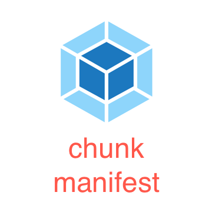

<div class="text-xs-center" align="center" style="margin: 20px">
  
</div>

<div class="text-xs-center" align="center">

[](https://www.npmjs.com/package/webpack-plugin-chunk-manifest)
[](https://webpack.js.org/)
[](https://www.npmjs.com/package/webpack-plugin-chunk-manifest)

</div>

## Introduction
Export a JSON file that maps chunk ids to their resulting asset files. This JSON file could be used for prefetch/preload.

> Looking to contribute? Pick up [an issue](https://github.com/znck/webpack-plugin-chunk-manifest/issues)!

## Documentation
#### Installation
```bash
yarn add --dev webpack-plugin-chunk-manifest
```

#### Usage
``` js
// File: webpack.config.js
const ChunkManifest = require('webpack-plugin-chunk-manifest');

module.exports = {
  ...
  plugins: [
    new ChunkManifest(),
  ],
  ...
}
```

#### Options
- filename: Chunk manifest would be stored in this file. Default: `manifest.json`
  ``` js
  new ChunkManifest({ filename: 'config/manifest.json' })
  ```
- transform: Transform chunks before storing. 
  ``` js
  new ChunkManifest({ 
    tranform (chunks) {
      // Remove manifest.js from chunks.
      Object.keys(chunks).forEach(key => {
        if (/manifest\.js$/.test(chunks[key])) {
          delete chunks[key]
        }
      })
    
      return chunks
    } 
  })
  ```

## License

[MIT](http://opensource.org/licenses/MIT)
